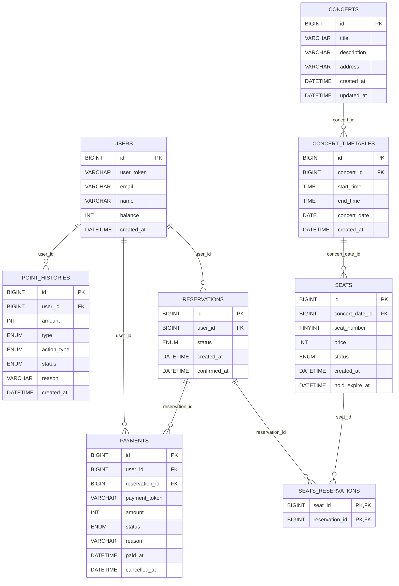

---

```SQL
-- 사용자 테이블
CREATE TABLE USERS
(
    id         BIGINT PRIMARY KEY AUTO_INCREMENT COMMENT '유저 ID',
    user_token VARCHAR(255) NOT NULL COMMENT '유저 식별 랜덤 문자',
    email      VARCHAR(50)  NOT NULL COMMENT '이메일 (로그인 ID)',
    name       VARCHAR(30)  NOT NULL COMMENT '사용자 이름',
    balance    INT UNSIGNED NOT NULL DEFAULT 0 COMMENT '잔액 (원 단위)',
    created_at DATETIME     NOT NULL DEFAULT CURRENT_TIMESTAMP COMMENT '가입일',
    UNIQUE (user_token),
    UNIQUE (email)
) CHARACTER SET utf8mb4
  COLLATE utf8mb4_unicode_ci
    COMMENT '유저 정보';


-- 콘서트 테이블
CREATE TABLE CONCERTS
(
    id          BIGINT PRIMARY KEY AUTO_INCREMENT COMMENT '콘서트 ID',
    title       VARCHAR(255) NOT NULL COMMENT '콘서트 제목',
    description VARCHAR(5000) COMMENT '콘서트 상세 설명',
    address     VARCHAR(500) NOT NULL COMMENT '콘서트 장소',
    created_at  DATETIME     NOT NULL DEFAULT CURRENT_TIMESTAMP,
    updated_at  DATETIME     NOT NULL DEFAULT CURRENT_TIMESTAMP ON UPDATE CURRENT_TIMESTAMP
) CHARACTER SET utf8mb4
  COLLATE utf8mb4_unicode_ci
    COMMENT '콘서트 상세 정보';

-- 예약 가능한 날짜 테이블
CREATE TABLE CONCERT_TIMETABLES
(
    id           BIGINT PRIMARY KEY AUTO_INCREMENT COMMENT '예약 가능한 날짜 ID',
    concert_id   BIGINT   NOT NULL COMMENT '콘서트 참조',
    start_time   TIME     NOT NULL COMMENT '콘서트 시작 시각',
    end_time     TIME     NOT NULL COMMENT '콘서트 종료 시각',
    concert_date DATE     NOT NULL COMMENT '날짜 (YYYY-MM-DD)',
    created_at   DATETIME NOT NULL DEFAULT CURRENT_TIMESTAMP,
    UNIQUE (concert_id, concert_date)
) CHARACTER SET utf8mb4
  COLLATE utf8mb4_unicode_ci
    COMMENT '콘서트가 열리는 날짜들';

CREATE INDEX idx_concert_timetable_by_concert_date ON CONCERT_TIMETABLES (concert_id, concert_date);


-- 좌석 테이블
CREATE TABLE SEATS
(
    id              BIGINT PRIMARY KEY AUTO_INCREMENT COMMENT '좌석 ID',
    concert_date_id BIGINT                                 NOT NULL COMMENT '해당 날짜 참조',
    seat_number     TINYINT UNSIGNED                       NOT NULL COMMENT '1~50 좌석 번호',
    price           INT UNSIGNED                           NOT NULL COMMENT '좌석 가격',
    status          ENUM ('AVAILABLE', 'HOLD', 'RESERVED') NOT NULL DEFAULT 'AVAILABLE' COMMENT '좌석 상태',
    created_at      DATETIME                               NOT NULL DEFAULT CURRENT_TIMESTAMP,
    hold_expire_at  DATETIME COMMENT '임시 배정 만료 시간',
    UNIQUE (concert_date_id, seat_number)
) CHARACTER SET utf8mb4
  COLLATE utf8mb4_unicode_ci
    COMMENT '콘서트의 좌석들';

CREATE INDEX idx_seats_available_by_concert_date ON SEATS (concert_date_id, status);
CREATE INDEX idx_seats_number_by_concert_date ON SEATS (concert_date_id, seat_number);


-- 예약 테이블
CREATE TABLE RESERVATIONS
(
    id           BIGINT PRIMARY KEY AUTO_INCREMENT COMMENT '예약 ID',
    user_id      BIGINT                                 NOT NULL COMMENT '예약자',
    status       ENUM ('HOLD', 'RESERVED', 'CANCELLED') NOT NULL COMMENT '예약 상태',
    created_at   DATETIME                               NOT NULL DEFAULT CURRENT_TIMESTAMP COMMENT '예약 시각',
    confirmed_at DATETIME COMMENT '결제 완료 시각'
) CHARACTER SET utf8mb4
  COLLATE utf8mb4_unicode_ci
    COMMENT '콘서트 좌석에 대한 예약';

CREATE INDEX idx_reservation_status ON RESERVATIONS (status);
CREATE INDEX idx_reservation_user_id ON RESERVATIONS (user_id, created_at desc);

CREATE TABLE SEATS_RESERVATIONS
(
    seat_id        BIGINT NOT NULL,
    reservation_id BIGINT NOT NULL,
    PRIMARY KEY (seat_id, reservation_id)
) CHARACTER SET utf8mb4
  COLLATE utf8mb4_unicode_ci
    COMMENT '좌석에 대한 예약 중간 테이블 N:N';

CREATE INDEX idx_seats_reservations_reservation_id ON SEATS_RESERVATIONS (reservation_id);

-- 결제 테이블
CREATE TABLE PAYMENTS
(
    id             BIGINT PRIMARY KEY AUTO_INCREMENT COMMENT '결제 ID',
    user_id        BIGINT                                   NOT NULL COMMENT '결제한 유저',
    reservation_id BIGINT                                   NOT NULL COMMENT '예약 참조',
    payment_token  VARCHAR(255)                             NOT NULL COMMENT '결제 정보 식별 랜덤 문자',
    amount         INT UNSIGNED                             NOT NULL COMMENT '결제 금액',
    status         ENUM ('SUCCESS', 'FAILED', 'CANCELLED') NOT NULL COMMENT '결제 상태 (성공, 실패, 취소)',
    reason         VARCHAR(255) COMMENT '실패 사유',
    paid_at        DATETIME                                 NOT NULL DEFAULT CURRENT_TIMESTAMP COMMENT '결제 시각',
    cancelled_at   DATETIME COMMENT '결제 취소 시각',
    UNIQUE (payment_token)
) CHARACTER SET utf8mb4
  COLLATE utf8mb4_unicode_ci
    COMMENT '예약에 대한 결제';

CREATE INDEX idx_payment_user_id ON PAYMENTS (user_id);
CREATE INDEX idx_payment_reservation_id ON PAYMENTS (reservation_id);


CREATE TABLE POINT_HISTORIES
(
    id          BIGINT PRIMARY KEY AUTO_INCREMENT COMMENT '포인트 이력 ID',
    user_id     BIGINT                             NOT NULL COMMENT '유저 ID',
    amount      INT UNSIGNED                       NOT NULL COMMENT '사용 금액',
    type        ENUM ('CHARGE', 'USAGE', 'CANCEL') NOT NULL COMMENT '행위 유형 (충전, 사용, 예약 취소)',
    action_type ENUM ('RESERVATION', 'CANCELLATION') COMMENT '사용 유형',
    status      ENUM ('SUCCESS', 'FAILED')         NOT NULL COMMENT '처리 상태',
    reason      VARCHAR(255) COMMENT '실패 사유',
    created_at  DATETIME                           NOT NULL DEFAULT CURRENT_TIMESTAMP COMMENT '발생 시각'
) CHARACTER SET utf8mb4
  COLLATE utf8mb4_unicode_ci
    COMMENT '포인트 히스토리 테이블';

CREATE INDEX idx_point_history_user_id_and_created_at_desc ON POINT_HISTORIES (user_id, created_at desc);
CREATE INDEX idx_point_history_type_status ON POINT_HISTORIES (type, status);


```
