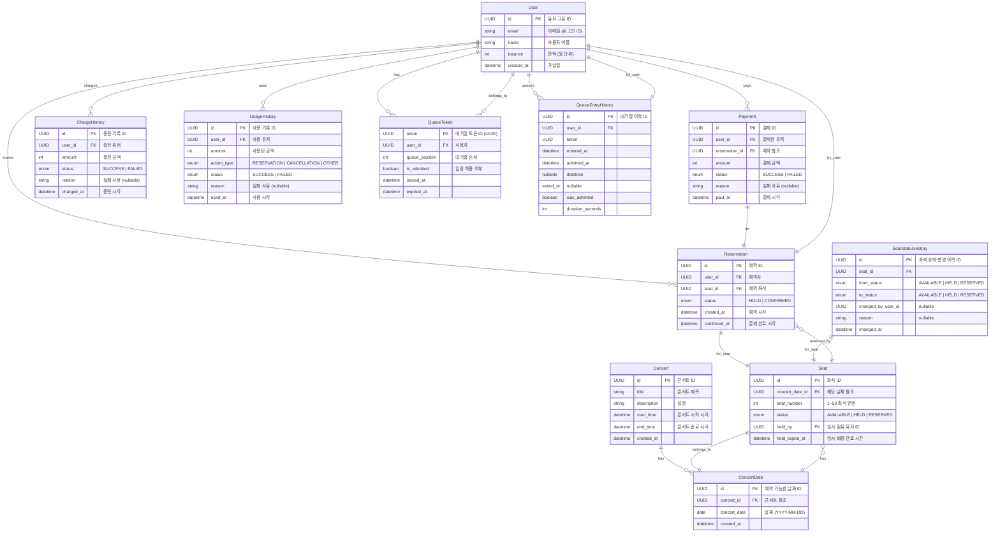

| 테이블                      | 용도                  |
| ------------------------ | ------------------- |
| `User`                   | 사용자 식별 및 잔액 관리      |
| `Concert`, `ConcertDate` | 콘서트 및 날짜 단위 구성      |
| `Seat`                   | 날짜별 좌석 및 상태 관리      |
| `Reservation`            | 좌석 예약 상태 기록         |
| `Payment`                | 결제 결과 및 실패 사유 추적    |
| `ChargeHistory`          | 충전 요청 내역 저장         |
| `UsageHistory`           | 잔액 사용 흐름 기록         |
| `QueueToken`             | 유저의 현재 대기열 토큰       |
| `QueueEntryHistory`      | 대기열 진입\~입장 전체 흐름 기록 |
| `SeatStatusHistory`      | 좌석 상태 전이 이력 기록      |
