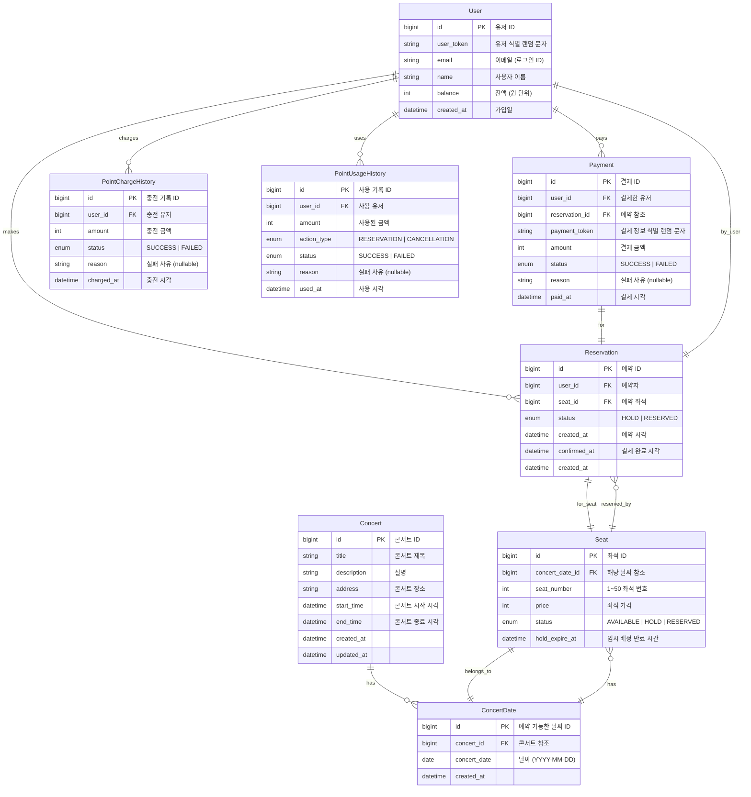

| 테이블                      | 용도                |
|--------------------------|-------------------|
| `User`                   | 사용자 식별 및 잔액 관리    |
| `Concert`, `ConcertDate` | 콘서트 -< 해당 콘서트 날짜들 |
| `Seat`                   | 날짜별 좌석 및 상태 관리    |
| `Reservation`            | 좌석 예약 상태 기록       |
| `Payment`                | 결제 결과             |
| `PointChargeHistory`     | 충전 요청 내역          |
| `PointUsageHistory`      | 잔액 사용 흐름          |
