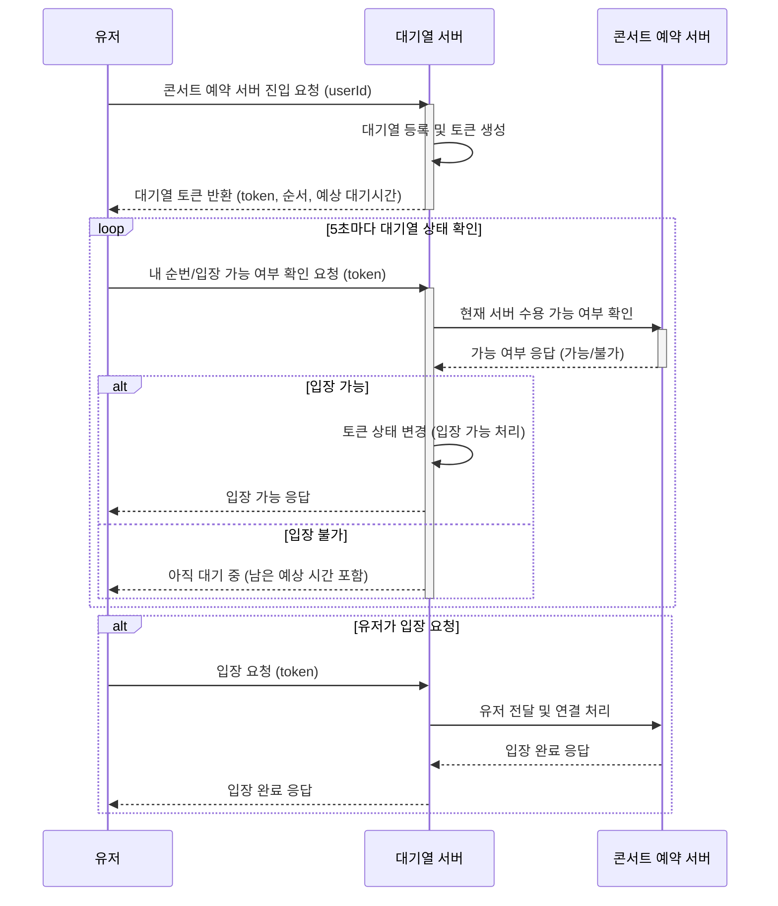
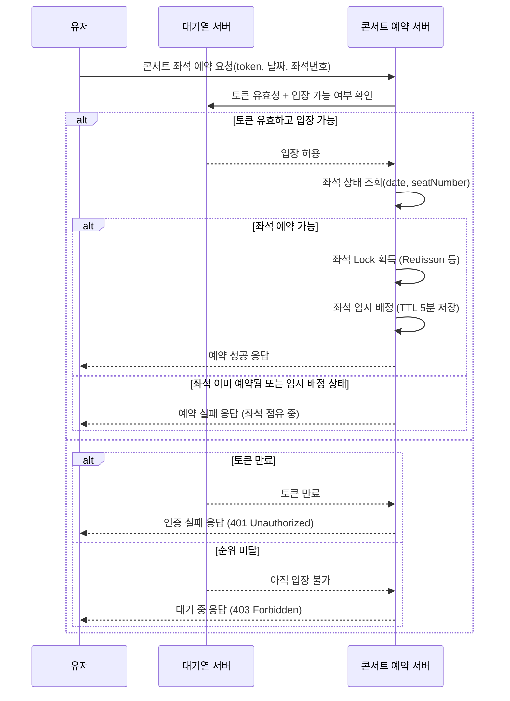
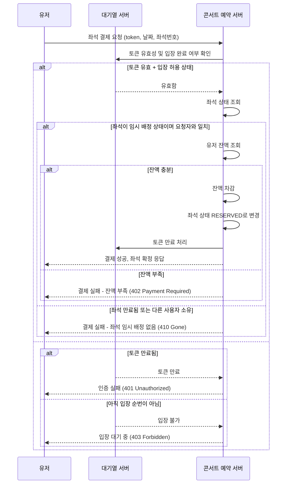

# 대기열을 거쳐 서버로 진입하는 플로우

```mermaid
sequenceDiagram
    participant 유저
    participant 대기 as 대기열 서버
    participant 서버 as 콘서트 예약 서버

%% 1. 유저가 대기열에 진입
    유저->>대기: 콘서트 예약 서버 진입 요청 (userId)
    activate 대기
    대기->>대기: 대기열 등록 및 토큰 생성
    대기-->>유저: 대기열 토큰 반환 (token, 순서, 예상 대기시간)
    deactivate 대기

%% 2. 폴링 방식으로 서버 진입 가능 여부 확인
    loop 5초마다 대기열 상태 확인

        유저->>대기: 내 순번/입장 가능 여부 확인 요청 (token)
        activate 대기

        대기->>서버: 현재 서버 수용 가능 여부 확인
        activate 서버
        서버-->>대기: 가능 여부 응답 (가능/불가)
        deactivate 서버

        alt 입장 가능
            대기->>대기: 토큰 상태 변경 (입장 가능 처리)
            대기-->>유저: 입장 가능 응답
        else 입장 불가
            대기-->>유저: 아직 대기 중 (남은 예상 시간 포함)
        end
        deactivate 대기

    end

%% 3. 입장 처리
    alt 유저가 입장 요청
        유저->>대기: 입장 요청 (token)
        대기->>서버: 유저 전달 및 연결 처리
        서버-->>대기: 입장 완료 응답
        대기-->>유저: 입장 완료 응답
    end
```
---
# 좌석 예약 요청 플로우

```mermaid
sequenceDiagram
    participant 유저
    participant 대기열 as 대기열 서버
    participant 서버 as 콘서트 예약 서버

%% 1. 콘서트 도메인 접근 시 대기열 검증
    유저->>서버: 콘서트 좌석 예약 요청(token, 날짜, 좌석번호)
    서버->>대기열: 토큰 유효성 + 입장 가능 여부 확인
    alt 토큰 유효하고 입장 가능
        대기열-->>서버: 입장 허용

    %% 2. 예약 처리 절차 시작
        서버->>서버: 좌석 상태 조회(date, seatNumber)
        alt 좌석 예약 가능
            서버->>서버: 좌석 Lock 획득 (Redisson 등)
            서버->>서버: 좌석 임시 배정 (TTL 5분 저장)
            서버-->>유저: 예약 성공 응답
        else 좌석 이미 예약됨 또는 임시 배정 상태
            서버-->>유저: 예약 실패 응답 (좌석 점유 중)
        end

    else
        alt 토큰 만료
            대기열-->>서버: 토큰 만료
            서버-->>유저: 인증 실패 응답 (401 Unauthorized)
        else 순위 미달
            대기열-->>서버: 아직 입장 불가
            서버-->>유저: 대기 중 응답 (403 Forbidden)
        end
    end
```
---
# 예약 결제 플로우

```mermaid
sequenceDiagram
    participant 유저
    participant 대기열 as 대기열 서버
    participant 서버 as 콘서트 예약 서버

    %% 1. 결제 요청
    유저->>서버: 좌석 결제 요청 (token, 날짜, 좌석번호)

    %% 2. 토큰 유효성 및 입장 상태 검증
    서버->>대기열: 토큰 유효성 및 입장 완료 여부 확인
    alt 토큰 유효 + 입장 허용 상태
        대기열-->>서버: 유효함

        %% 3. 좌석 임시 배정 상태 확인
        서버->>서버: 좌석 상태 조회
        alt 좌석이 임시 배정 상태이며 요청자와 일치
            서버->>서버: 유저 잔액 조회
            alt 잔액 충분
                서버->>서버: 잔액 차감
                서버->>서버: 좌석 상태 RESERVED로 변경
                서버->>대기열: 토큰 만료 처리
                서버-->>유저: 결제 성공, 좌석 확정 응답
            else 잔액 부족
                서버-->>유저: 결제 실패 - 잔액 부족 (402 Payment Required)
            end
        else 좌석 만료됨 또는 다른 사용자 소유
            서버-->>유저: 결제 실패 - 좌석 임시 배정 없음 (410 Gone)
        end

    else
        alt 토큰 만료됨
            대기열-->>서버: 토큰 만료
            서버-->>유저: 인증 실패 (401 Unauthorized)
        else 아직 입장 순번이 아님
            대기열-->>서버: 입장 불가
            서버-->>유저: 입장 대기 중 (403 Forbidden)
        end
    end

```